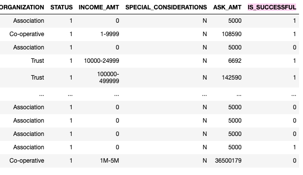
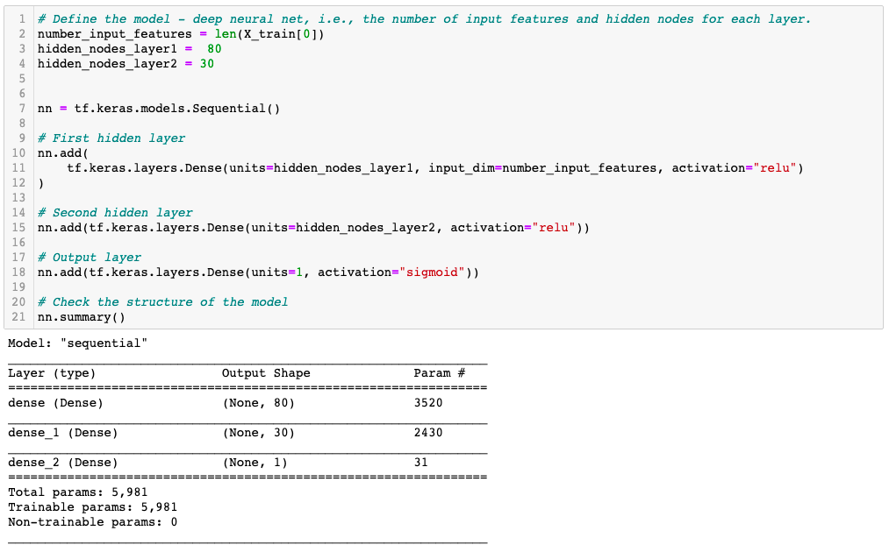
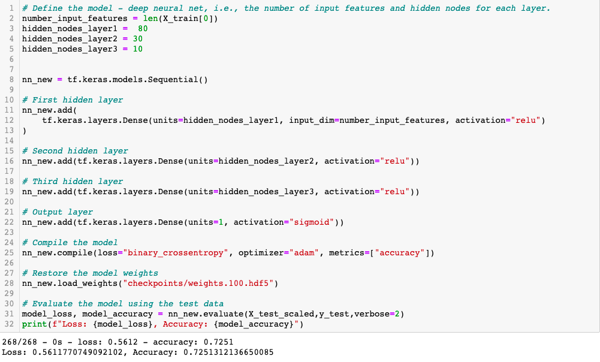

# Neural_Network_Charity_Analysis

## Overview of the Analysis 
In this analysis we used machine learning and neural networks to create a binary classifier will help predict whether applicants will be successful if funded by AlphabetSoup. The dataset consists of funding received by over 34,000 organizations. The data was preprocessed for a neural network model. The model was then compiled, trained, evaluated and optimized. 

## Results 
### Data Processing
1) What variable(s) are considered the target(s) for your model?
The IS_SUCCESSFUL column was the target for the model. 

2) What variable(s) are considered to be the features for your model?
All the columns except the ones that were dropped (EIN and NAME) are considered to be the features of the model. These variables include Income_Amt, Organization, Classification etc. 

3) What variable(s) are neither targets nor features, and should be removed from the input data?
The identification columns, EIN and NAME, were removed from the data as they were neither targets nor features. 

### Compiling, Training, and Evaluating the Model
1) How many neurons, layers, and activation functions did you select for your neural network model, and why?
For the neural network model I selected 2 hidden layers. The first hidden layer had 80 neurons, and the second hidden layer had 30 neurons. The hidden layers have a relu activation function, and the outer layer has a sigmoid activtion function. 

2)Were you able to achieve the target model performance?
The model was not able to reach the target performance of over 75% predictive accuracy. The highest accuracy was 72.51%.

3)What steps did you take to try and increase model performance?
In the optimization stages I added an extra hidden layer and changed the number of neurons. I also altered the epochs. I played around with different activation functions, but ultimately felt that the relu worked best. 

